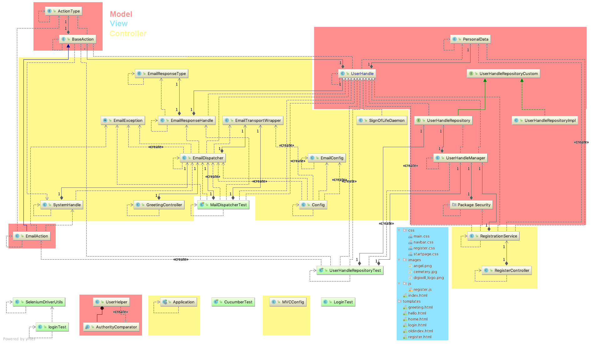
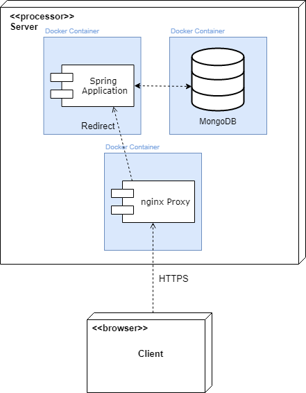
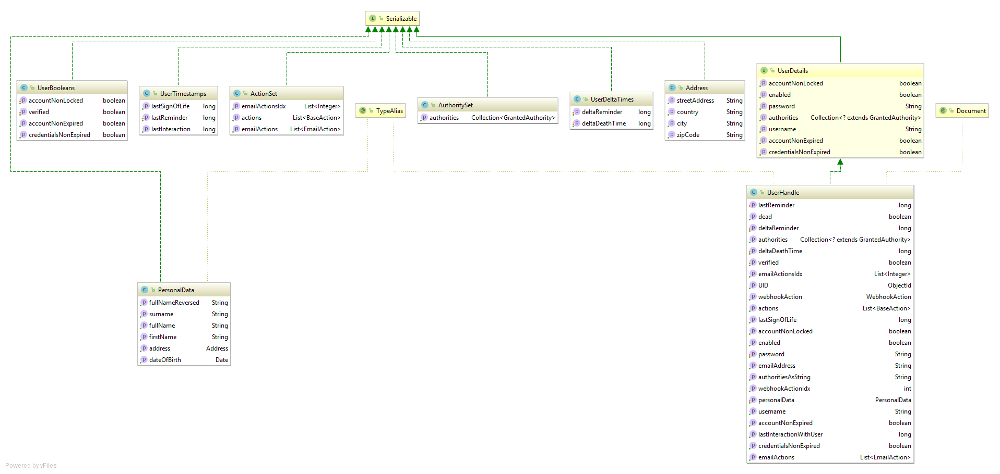

# Software Architecture Document

# Table of Contents
- [Introduction](#1-introduction)
    - [Purpose](#11-purpose)
    - [Scope](#12-scope)
    - [Definitions, Acronyms and Abbreviations](#13-definitions-acronyms-and-abbreviations)
    - [References](#14-references)
    - [Overview](#15-overview)
- [Architectural Representation](#2-architectural-representation)
- [Architectural Goals and Constraints](#3-architectural-goals-and-constraints)
- [Use-Case View](#4-use-case-view)
- [Logical View](#5-logical-view)
    - [Overview](#51-overview)
    - [Architecturally Significant Design Packages](#52-architecturally-significant-design-packages)
- [Process View](#6-process-view)
- [Deployment View](#7-deployment-view)
- [Implementation View](#8-implementation-view)
- [Data View](#9-data-view)
- [Size and Performance](#10-size-and-performance)
- [Quality](#11-quality)

## 1. Introduction

### 1.1 Purpose
This document provides a comprehensive architectural overview of the system, using a number of different architectural views to depict different aspects of the system. It is intended to capture and convey the significant architectural decisions which have been made on the system.

### 1.2 Scope
This document describes the technical architecture of the DigiWill project, including the structure of classes, modules and dependencies.

### 1.3 Definitions, Acronyms and Abbreviations

| Abbrevation | Description                            |
| ----------- | -------------------------------------- |
| API         | Application programming interface      |
| MVC         | Model View Controller                  |
| REST        | Representational state transfer        |
| SDK         | Software development kit               |
| SRS         | Software Requirements Specification    |
| UC          | Use Case                               |
| VCS         | Version Control System                 |
| n/a         | not applicable                         |

### 1.4 References

| Title                                                              | Date       | Publishing organization   |
| -------------------------------------------------------------------|:----------:| ------------------------- |

### 1.5 Overview
This document contains the Architectural Representation, Goals and Constraints as well
as the Logical, Deployment, Implementation and Data Views.

## 2. Architectural Representation
We are trying to implement according to the MVC pattern:

## 3. Architectural Goals and Constraints
We decided to use Spring MVC as our main framework. It allows us to unite backend, frontend development and the database integration in one code base.

## 4. Use-Case View
Our overall UC diagram:

## 5. Logical View

### 5.1 Overview
The following image shows a UML diagram of our project whose elements are categorized by model, view and controller.

### 5.2 Architecturally Significant Design Packages
We always try to classify our classes in modules. The module `de.digiwill.model` contains model classes for data preparation and handeling and `de.digiwill.repository` contains classes for access data from the database. Service-, controller- and utility-classes are also classified in seperate packages.

## 6. Process View
TODO

## 7. Deployment View

## 9. Data View
Our database structure in model classes:

## 10. Size and Performance
n/a

## 11. Quality/Metrics
We are using Jenkins as an continuous integration tool to ensure a high quality of our development process. Whenever there is a new commit to a pull request or the master branch it automatically builds the project and executes all tests. The Jenkins build result will be displayed beside each commit on Github.
In addition SonarQube and Codacy are used in our pipeline. Each pull request/commit is checked by both tools. To improve our code quality we are focusing on: 
* Test Coverage: A high coverage ensures that existing functionality can not break during the development process. The coverage is calculated by the Jacoco Maven Plugin and the plugin results are pushed to SonarQube.
* Reducing the amount of Bugs/Issues/Code Smells raised by SonarQube.

The SonarQube Metrics as well as the Pull Request Labels from Codacy are very helpful for improving our code quality and solving problem spots.
