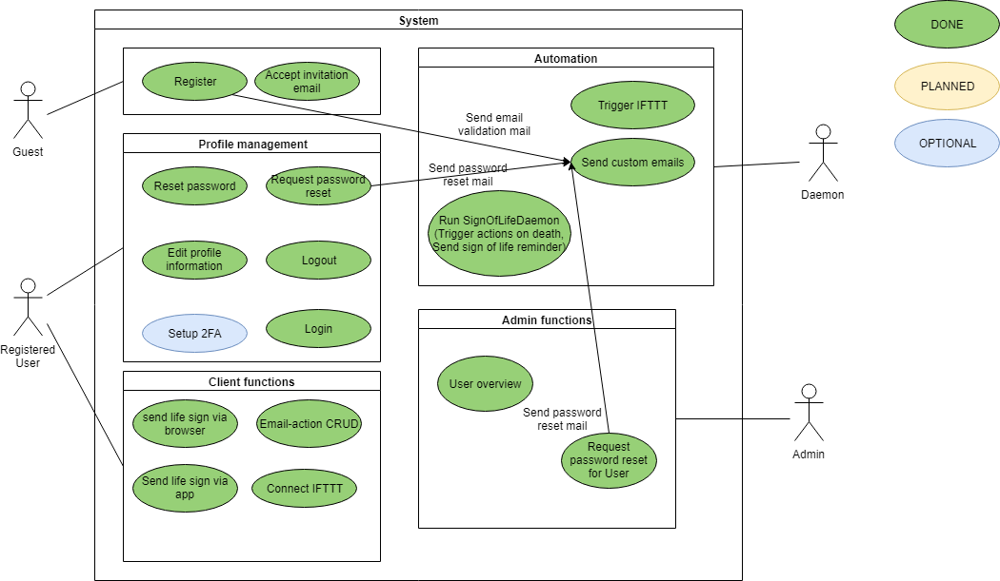

# Software Requirements Specification

**DigiWill**

**Software Requirements Specification**

**For DigiWill**

**Version 0.2**

### Revision History

| Date        | Version | Description | Author  |
|-------------|---------|-------------|---------|
| 21/Oct/18 | 0.1   | First draft  | Jannik Möll |
| 23/Oct/18 | 0.2   | Second draft  | Jannik Möll |

### Table of Contents

- [Software Requirements Specification](#software-requirements-specification)
		- [Revision History](#revision-history)
		- [Table of Contents](#table-of-contents)
	- [Software Requirements Specification](#software-requirements-specification-1)
	- [1 Introduction](#1-introduction)
		- [1.1 Purpose](#11-purpose)
		- [1.2 Scope](#12-scope)
		- [1.3 Definitions, Acronyms and Abbreviations](#13-definitions-acronyms-and-abbreviations)
		- [1.4 References](#14-references)
		- [1.5 Overview](#15-overview)
	- [2 Overall Description](#2-overall-description)
		- [2.1 Vision](#21-vision)
		- [2.2 Product perspective](#22-product-perspective)
		- [2.3 Constraints](#23-constraints)
		- [2.4 User characteristics](#24-user-characteristics)
		- [2.5 Dependencies](#25-dependencies)
	- [3 Specific Requirements](#3-specific-requirements)
		- [3.1 Functionality - Backend](#31-functionality---backend)
			- [3.1.1. Sign of life daemon](#311-sign-of-life-daemon)
			- [3.1.2 Email daemon](#312-email-daemon)
		- [3.2 Functionality - Browser based Frontend](#32-functionality---browser-based-frontend)
			- [3.2.1 Log in + Log out](#321-log-in--log-out)
			- [3.2.2 Reset password](#322-reset-password)
			- [3.2.3 Edit profile information](#323-edit-profile-information)
			- [3.2.4 Setup emails](#324-setup-emails)
			- [3.2.5 Set up 2FA](#325-set-up-2fa)
			- [3.2.6 Send sign of life](#326-send-sign-of-life)
		- [3.3 Usability](#33-usability)
			- [3.3.1 Ease of use - Setting up](#331-ease-of-use---setting-up)
			- [3.3.2 Signs of life](#332-signs-of-life)
		- [3.4 Reliability](#34-reliability)
			- [3.4.1 Sign of life uptime](#341-sign-of-life-uptime)
			- [3.4.2 Initiation of actions](#342-initiation-of-actions)
		- [3.5 Performance](#35-performance)
			- [3.5.1 Live interaction](#351-live-interaction)
			- [3.5.2 Emails](#352-emails)
		- [3.6 Supportability](#36-supportability)
			- [3.6.1 Code](#361-code)
			- [3.6.2 Git Commits](#362-git-commits)
		- [3.7 Design Constraints](#37-design-constraints)
			- [3.7.1 MVC architecture](#371-mvc-architecture)
			- [3.7.2 Git](#372-git)
			- [3.7.3 Security](#373-security)
		- [3.8 Online User Documentation and Help System Requirements](#38-online-user-documentation-and-help-system-requirements)
		- [3.9 Purchased Components](#39-purchased-components)
		- [3.10 Interfaces](#310-interfaces)
			- [3.10.1 User Interfaces](#3101-user-interfaces)
				- [3.10.1.1 Website](#31011-website)
				- [3.10.1.2 Android App](#31012-android-app)
			- [3.10.2 Hardware Interfaces](#3102-hardware-interfaces)
			- [3.10.3 Software Interfaces](#3103-software-interfaces)
				- [3.10.3.1 MongoDB](#31031-mongodb)
				- [3.10.3.2 Mail Server](#31032-mail-server)
				- [3.10.3.3 IFTTT](#31033-ifttt)
			- [3.11.4 Communications Interfaces](#3114-communications-interfaces)
		- [3.12 Licensing Requirements](#312-licensing-requirements)
		- [3.14 Applicable Standards](#314-applicable-standards)
	- [4 Supporting Information](#4-supporting-information)

<!--- [1. Introduction](#1-introduction)         
  - [1.1 Purpose](#11-purpose)     
  - [1.2 Scope](#12-scope)     
  - [1.3 Definitions, Acronyms and Abbreviations](#13-definitions-acronyms-and-abbreviations)     
  - [1.4 References](#14-references)     
  - [1.5 Overview](#15-overview)     
- [Software Requirements Specification](#software-requirements-specification)
		- [Revision History](#revision-history)
		- [Table of Contents](#table-of-contents)
	- [Software Requirements Specification](#software-requirements-specification-1)
	- [1 Introduction](#1-introduction)
		- [1.1 Purpose](#11-purpose)
		- [1.2 Scope](#12-scope)
		- [1.3 Definitions, Acronyms and Abbreviations](#13-definitions-acronyms-and-abbreviations)
		- [1.4 References](#14-references)
		- [1.5 Overview](#15-overview)
	- [2 Overall Description](#2-overall-description)
		- [2.1 Vision](#21-vision)
		- [2.2 Product perspective](#22-product-perspective)
		- [2.3 Constraints](#23-constraints)
		- [2.4 User characteristics](#24-user-characteristics)
		- [2.5 Dependencies](#25-dependencies)
	- [3 Specific Requirements](#3-specific-requirements)
		- [3.1 Functionality - Backend](#31-functionality---backend)
			- [3.1.1. Sign of life daemon](#311-sign-of-life-daemon)
			- [3.1.2 Email daemon](#312-email-daemon)
		- [3.2 Functionality - Browser based Frontend](#32-functionality---browser-based-frontend)
			- [3.2.1 Log in + Log out](#321-log-in--log-out)
			- [3.2.2 Reset password](#322-reset-password)
			- [3.2.3 Edit profile information](#323-edit-profile-information)
			- [3.2.4 Setup emails](#324-setup-emails)
			- [3.2.5 Set up 2FA](#325-set-up-2fa)
			- [3.2.6 Send sign of life](#326-send-sign-of-life)
		- [3.3 Usability](#33-usability)
			- [3.3.1 Ease of use - Setting up](#331-ease-of-use---setting-up)
			- [3.3.2 Signs of life](#332-signs-of-life)
		- [3.4 Reliability](#34-reliability)
			- [3.4.1 Sign of life uptime](#341-sign-of-life-uptime)
			- [3.4.2 Initiation of actions](#342-initiation-of-actions)
		- [3.5 Performance](#35-performance)
			- [3.5.1 Live interaction](#351-live-interaction)
			- [3.5.2 Emails](#352-emails)
		- [3.6 Supportability](#36-supportability)
			- [3.6.1 Code](#361-code)
			- [3.6.2 Git Commits](#362-git-commits)
		- [3.7 Design Constraints](#37-design-constraints)
			- [3.7.1 MVC architecture](#371-mvc-architecture)
			- [3.7.2 Git](#372-git)
			- [3.7.3 Security](#373-security)
		- [3.8 Online User Documentation and Help System Requirements](#38-online-user-documentation-and-help-system-requirements)
		- [3.9 Purchased Components](#39-purchased-components)
		- [3.10 Interfaces](#310-interfaces)
			- [3.10.1 User Interfaces](#3101-user-interfaces)
				- [3.10.1.1 Website](#31011-website)
				- [3.10.1.2 Android App](#31012-android-app)
			- [3.10.2 Hardware Interfaces](#3102-hardware-interfaces)
			- [3.10.3 Software Interfaces](#3103-software-interfaces)
				- [3.10.3.1 MongoDB](#31031-mongodb)
				- [3.10.3.2 Mail Server](#31032-mail-server)
				- [3.10.3.3 IFTTT](#31033-ifttt)
			- [3.11.4 Communications Interfaces](#3114-communications-interfaces)
		- [3.12 Licensing Requirements](#312-licensing-requirements)
		- [3.14 Applicable Standards](#314-applicable-standards)
	- [4 Supporting Information](#4-supporting-information)

## Software Requirements Specification

## 1 Introduction

### 1.1 Purpose

The purpose of this document is to provide a general overview and a detailed description of the DigiWill project. In order to achieve this, it explains the general vision or rather the purpose and all the features of the product. This document offers insights into the system, its interfaces and the constraints of the product.

<!--\[Specify the purpose of this **SRS**. The **SRS** should fully describe the external behavior of the application or subsystem identified. It also describes nonfunctional requirements, design constraints and other factors necessary to provide a complete and comprehensive description of the requirements for the software.\]--->

### 1.2 Scope
This document is designed for internal use only and acts as the primary requirement specification for the DigiWill project. An overview of the features and modules of the product are documented in the use case diagram (Overall Description).

### 1.3 Definitions, Acronyms and Abbreviations

|Term|Definition|
|-|-|
|**SRS**|Software Requirements Specification|
|**[IFTTT](https://ifttt.com/)**|If This Than That|
|**2FA**|Two-factor authentication|
|**MTTR**|Mean Time To Repair|
|**MVC**|Model View Controller|
|**FAQ**|Frequently Asked Questions|

### 1.4 References
n/a

<!--|Title|Date|Misc|
|-|-|-|
|[Title](link)|2018-10-19|-|

\[This subsection should provide a complete list of all documents referenced elsewhere in the **SRS**.  Each document should be identified by title, report number (if applicable), date, and publishing organization.  Specify the sources from which the references can be obtained. This information may be provided by reference to an appendix or to another document.\]--->

### 1.5 Overview
This document describes the specification for the DigiWill service and project. It outlines our vision and plan, explains requirements and functionalities and provides specifications for usability, reliability, performance and interfaces of the service.

<!--\[This subsection should describe what the rest of the **SRS** contains and explain how the document is organized.\]--->

## 2 Overall Description

### 2.1 Vision
DigiWill is going to be a digital will-keeper that helps you maintain your will and execute it in the event of your death.

DigiWill will give you the ability to specify actions the tool should take in the event of your death. These actions could range from sending pre-written emails to specified recipients to deleting messages and/or accounts from social media sites. More exotic features like automatically transferring money to the bank account of specified heirs and integration with services such as IFTTT are also under consideration.

### 2.2 Product perspective

*use case diagram*

### 2.3 Constraints
Due to laws on inheritance some actions such as redistributing funds to heirs can only be carried out be actual notaries. Depending on the jurisdiction of our client we won't be able to provide certain services. Some actions such as deleting someones social media account might not be automatable since the social media services don't allow it or don't provide the functionality.

### 2.4 User characteristics
Our target group consists of individuals who want to make a conscious decision about their will. They want to be able to decide what happens to their belongings after they die and want to be able to send people messages in the event of their death. e.g. someone has kept a secret from a loved on for ages and wants to let them know after they're dead.

Our users want to be certain that the service actually carries out the actions specified in their digital will.

### 2.5 Dependencies
The main function of the service, detecting someones death and carrying out actions in the event of their death, depends on the reliable detection of signs of life / signs of death. For the current plan this means there is a huge dependency on the users reliability to periodically notify the service of still being alive.

## 3 Specific Requirements

<!--\[This section of the **SRS** should contain all the software requirements to a level of detail sufficient to enable designers to design a system to satisfy those requirements, and testers to test that the system satisfies those requirements.   When using use-case modeling, these requirements are captured in the Use-Cases and the applicable supplementary specifications.  If use-case modeling is not used, the outline for supplementary specifications may be inserted directly into this section, as shown below.\]-->

### 3.1 Functionality - Backend

#### 3.1.1. [Sign of life daemon](../UC/sign_of_life_daemon.md)
The sign of life daemon periodically checks the the duration since the last sign of life for every users and if necessary initiates actions the user wants the service to take after a certain duration. (e.g. Sends a task to the Email daemon to send out specified emails)

#### 3.1.2 Email daemon
The email daemon sends out emails to specified recipients when notified by the sign of life daemon. It can also send emails when a new user creates and account, forgets their password or updates their information.

<!--\[This section describes the functional requirements of the system for those requirements which are expressed in the natural language style. For many applications, this may constitute the bulk of the **SRS** Package and thought should be given to the organization of this section. This section is typically organized by feature, but alternative organization methods may also be appropriate, for example, organization by user or organization by subsystem.  Functional requirements may include feature sets, capabilities, and security.

Where application development tools, such as requirements tools, modeling tools, etc., are employed to capture the functionality, this section document will refer to the availability of that data, indicating the location and name of the tool that is used to capture the data.\]-->

### 3.2 Functionality - Browser based Frontend

#### 3.2.1 [Log in](../UC/login.md) + [Log out](../UC/logout.md)
The user can log into the web interface using an alias / email address and a password. If the user enabled 2FA he/she will also need a 2FA code. 
Logically, he should also be able to log out.

#### 3.2.2 [Reset password](../UC/requestPasswordReset.md)
The user can reset their password by clicking a "Rest password" button on the log in page. He/she will then receive an email with instructions to set up a new password.

#### 3.2.3 [Edit profile information](../UC/edit_profile_information.md)
The user can specify after how many days of not receiving a sign of life the service should send an email / notification / call to remind the user. The user can also specify after how many days the service should presume the user is dead. He/she can edit their email address, physical address, country of residence and maintain connections / log in credentials for social media or other services DigiWill should interact with.

#### 3.2.4 [Setup emails](../UC/setup_custom_emails.md)
The user can write emails and specify recipients. He/she can also specify how long after the presumed death the emails should be send out.

#### 3.2.5 Set up 2FA
The user can set up two factor authentication using an app like Google Authenticator or Authy.

#### 3.2.6 Send sign of life
The user can [send a sign of life](../UC/send_life_sign.md) to the service by pressing a button. If the user has enabled 2FA in addition to the button a text input field will appear. Pressing the button will check the entered 2FA code. If the code was correct this counts as a sign of life.

### 3.3 Usability

<!---\[This section should include all of those requirements that affect usability. For example,

•               specify the required training time for a normal users and a power user to become productive at particular operations

•               specify measurable task times for typical tasks or base the new system’s usability requirements on other systems that the users know and like

•               specify requirement to conform to common usability standards, such as IBM’s CUA standards Microsoft’s GUI standards\]--->

#### 3.3.1 Ease of use - Setting up

The service should be intuitive and easy to use. It shouldn't require any training and shouldn't require the user to read a long manual. Setting up an account and specifying actions in ones will should be easy and straight forward.

#### 3.3.2 Signs of life

Letting the service know that you're still alive should be as easy as possible and as fast as possible. It should take less than a minute while being hassle free or even fun.

### 3.4 Reliability

<!--\[Requirements for reliability of the system should be specified here. Some suggestions follow:

•               Availability—specify the percentage of time available ( xx.xx%), hours of use, maintenance access, degraded mode operations, etc.

•               Mean Time Between Failures (MTBF) — this is usually specified in hours, but it could also be specified in terms of days, months or years.

•               Mean Time To Repair (MTTR)—how long is the system allowed to be out of operation after it has failed?

•               Accuracy—specify precision (resolution) and accuracy (by some known standard) that is required in the system’s output.

•               Maximum Bugs or Defect Rate—usually expressed in terms of bugs per thousand of lines of code (bugs/KLOC) or bugs per function-point( bugs/function-point).

•               Bugs or Defect Rate—categorized in terms of minor, significant, and critical bugs: the requirement(s) must define what is meant by a “critical” bug; for example, complete loss of data or a complete inability to use certain parts of the system’s functionality.\]--->

#### 3.4.1 Sign of life uptime
The ability to send a sign of life to the service should be available 95% of the time. And should never be unavailable for longer than 3 hours at a time (MTTR).

#### 3.4.2 Initiation of actions
Actions the user specified for the event of their death should be carried out as fast as possible after they're triggered. 95% of all actions should be initiated within 15 minutes of the time our client specified. Every action should be completed within 5 hours of the specified time.

### 3.5 Performance
<!--\[The system’s performance characteristics should be outlined in this section. Include specific response times. Where applicable, reference related Use Cases by name.

•               response time for a transaction (average, maximum)

•               throughput, for example, transactions per second

•               capacity, for example, the number of customers or transactions the system can accommodate

•               degradation modes (what is the acceptable mode of operation when the system has been degraded in some manner)

•               resource utilization, such as memory, disk, communications, etc.\]--->

#### 3.5.1 Live interaction
Any changes the user makes to his/her data (settings, actions, etc.) should be saved to the database instantaneously. This should only be delayed by network delays.

#### 3.5.2 Emails
Emails related to client administration should reach the client within 5 minutes.
Emails related to actions the user planned for the event of their death should be sent out within 15 minutes. If the service is degraded these emails should be sent out as soon as possible but within 5 hours.

### 3.6 Supportability

<!--\[This section indicates any requirements that will enhance the supportability or maintainability of the system being built, including coding standards, naming conventions, class libraries, maintenance access, maintenance utilities.\]--->

#### 3.6.1 Code
Code just follow conventions for the respective language (e.g. camel case for Java). Functions and variables should have self explanatory names and the code should be commented well.

#### 3.6.2 Git Commits
- The summary should start with `[Backend]`, `[Frontend]`, `[Documentation]` or whatever area the commit is relevant to
- This should be followed by one of the following tags: `[Bug]`(Bug Fix), `[Feat]`(Feature), `[Misc]`(Miscellaneous)
- After that you should add your actual commit message and fill the description with relevant details

### 3.7 Design Constraints

<!--\[This section should indicate any design constraints on the system being built. Design constraints represent design decisions that have been mandated and must be adhered to.  Examples include software languages, software process requirements, prescribed use of developmental tools, architectural and design constraints, purchased components, class libraries, etc.\]--->

#### 3.7.1 MVC architecture
The service should implement the MVC architecture.

#### 3.7.2 Git
Git should be used as the version control system for this project.

#### 3.7.3 Security
Passwords should never be transmitted or stored in plain text.
SQL injections or similar malicious actions should be prevented.

### 3.8 Online User Documentation and Help System Requirements
The website should contain well maintained documentation on how to use the service. It should include information about the basic principle of the service but also go in depth about how to set up actions such as sending emails.

<!--\[Describes the requirements, if any, for on-line user documentation, help systems, help about notices, etc.\]--->

### 3.9 Purchased Components
There are no purchased components. The application will run on a private server hosted at [contabo.de](https://contabo.de)

### 3.10 Interfaces

<!---\[This section defines the interfaces that must be supported by the application. It should contain adequate specificity, protocols, ports and logical addresses, etc. so that the software can be developed and verified against the interface requirements.\]-->

#### 3.10.1 User Interfaces

##### 3.10.1.1 Website

The website should provide multiple interfaces to the user. The landing page should contain general information about the service, buttons to `log in` and `register` and links to an `About`, `FAQ` and `Help` page.

The register page should ask for the users *email address*, an optional *alias*, a *password* and general information about the user such as their *real name*, *birthday*, *address* and *phone number*. The end of the page should contain a `register` button which. Clicking it should check all input field for valid inputs and send a request to the server to register a new user. In turn the server sends an email to the new user to verify their email address.

The log in page should contain input fields for a *username/email address* and *password* and a button to `log in`. If the credentials were correct it should forward the user to their account page. If the users has 2FA enabled it should first ask for the 2FA code (and allow retries) before forwarding to the account page. If the credentials were wrong the user should be notified and asked to enter them again.

The users account page should contain an overview about the actions they set up, the services their account is connected to and a button to edit their data (e.g. address, phone number, etc.). Depending on when the user send their last sign of life a big button should appear on the top of the page to send a sign of life. Depending on the uses settings the account page should contain a countdown which counts down to the moment the service presumes they are dead. This countdown will reset with every sign of life the service receives.

Clicking the action preview on the account page should open the action maintenance page. Here the user can manage the actions the service should take in the event of their death.
It should contain a table that lists all actions the user specified. The table should contain information about the actions such as a *title*, *state* (activated, deactivated, draft), *category* (e.g. email, social media, etc) and *trigger time* after the presumed time of death. Every table item should have an `Edit` button to change the details of the action. The top of the page should have a `Create new action` button which opens a dialog that asks the user what kind of action they want to create (email, social media, etc) and guides them through creating that new action.

The dialog to create a new email action should remind the user of a normal email client and contain a *recipients* and *subject* line and a text field for the *body* of the email. Additionally the dialog should also provide the user with a text field to set a *title* for the action, specify a *trigger time* in relation to the presumed time of death and a *state* (activated, deactivated, draft, etc.). Finally the dialog should have a `Save` button which checks all field for valid inputs and submits the new action to the server and adds it to the table.

Dialog for other actions should contain similar options and be overall similar to the email dialog.

##### 3.10.1.2 Android App
The app should only consist of two screens, one to log in to the DigiWill account and one to send a sign of life to the service via a simple button. If the user has 2FA enabled the sign of life screen will also contain a text field to enter the 2FA code. The user can enable a countdown which counts down to the moment the service presumes they're dead. This countdown will reset with every sign of life the service receives.

<!--\[Describe the user interfaces that are to be implemented by the software.\]--->

#### 3.10.2 Hardware Interfaces
n/a

#### 3.10.3 Software Interfaces

##### 3.10.3.1 MongoDB
The backend will interact with a MongoDB database. The database will be used to store the data relevant to the operations of the service.

##### 3.10.3.2 Mail Server
For our email shipment for example of registration and reset password we want setup a self hosted mail server. We use the docker image [tomav/docker-mailserver](https://github.com/tomav/docker-mailserver) that can be installed without much effort.

##### 3.10.3.3 IFTTT
IFTTT is a service that allows users to setup triggers and correlate them with actions. e.g. their home thermostat reaches a certain threshold so the service sends them an email. We are planning to interface with IFTT to provide a "death trigger". That way the user can trigger loads of diverse actions when DigiWill detects they died. That way we won't have to build interfaces for thousands of services but can simply rely on IFTT to connect to loads of other services and trigger nearly any action the user can imagine. 

<!--\[This section describes software interfaces to other components of the software system. These may be purchased components, components reused from another application or components being developed for subsystems outside of the scope of this **SRS** but with which this software application must interact.\]--->

#### 3.11.4 Communications Interfaces
The client will connect to the server over <code>HTTPS</code> on port 443. Unencrypted connections over <code>HTTP</code> shall redirect to an encrypted connection.
<!--\[Describe any communications interfaces to other systems or devices such as local area networks, remote serial devices, etc.\]--->

### 3.12 Licensing Requirements
n/a
<!--\[Defines any licensing enforcement requirements or other usage restriction requirements that are to be exhibited by the software.\]--->

### 3.14 Applicable Standards
The following standards are going to be applied to the code:
* Comments for understanding complex code sections
* Design patterns integration
* Intuitive names of variables and methods.

<!--\[This section describes by reference any applicable standard and the specific sections of any such standards which apply to the system being described. For example, this could include legal, quality and regulatory standards, industry standards for usability, interoperability, internationalization, operating system compliance, etc.\]--->

## 4 Supporting Information
For more information contact:
* Christian Schweigel
* Jannik Möll
* Morten Harter
* Robin Kuck

<!--\[The supporting information makes the **SRS** easier to use.  It includes:

•               Table of contents

•             Index

•               Appendices

These may include use-case storyboards or user-interface prototypes. When appendices are included, the **SRS** should explicitly state whether or not the appendices are to be considered part of the requirements.\]--->
