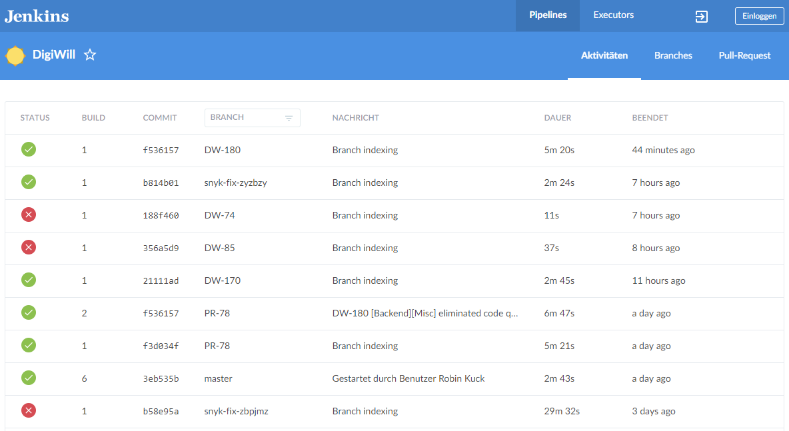
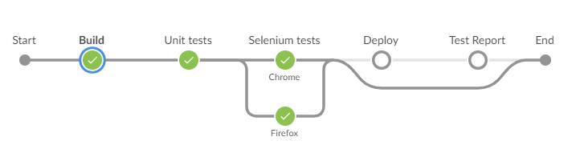
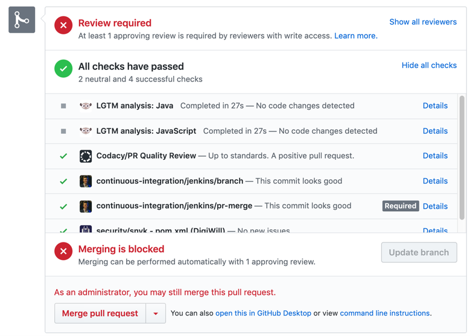

# Test Plan

## 1. Introduction

### 1.1 Purpose
The purpose of the Iteration Test Plan is to gather all of the information necessary to plan and control the test effort for a given iteration. It describes the approach to testing the software, and is the top-level plan generated and used by managers to direct the test effort.
This Test Plan for DigiWill supports the following objectives:
* Identifies the items that should be targeted by the tests.
* Identifies the motivation for and ideas behind the test areas to be covered.
* Outlines the testing approach that will be used.
* Identifies the required resources and provides an estimate of the test efforts.
* Lists the deliverable elements of the test project.

### 1.2 Scope
This document describes the used tests, as they are unittests and functionality testing.
### 1.3 Intended Audience
This document is meant for internal use primarily.
### 1.4 Document Terminology and Acronyms
* SRS - Software Requirements Specification
* SOL - Sign of life
* n/a - not applicable
* tbd - to be determined

### 1.5 References
* [Github](https://github.com/DigiWill-dhbw/DigiWill)
* [Blog](https://digiwill71076886.wordpress.com/)
* [Use Case Diagram](https://github.com/DigiWill-dhbw/Documentation/blob/master/SRS/UC_Diagram.png)
* [SRS](https://github.com/DigiWill-dhbw/Documentation/blob/master/SRS/SRS.md)
* [SAD](https://github.com/DigiWill-dhbw/Documentation/blob/master/SAD/SAD.md)

## 2. Evaluation Mission and Test Motivation

### 2.1 Background
By testing our project, we intend to provide stability and safety for our project when the source code changes. The integration of the testing in our development process, allows us to be sure that only working versions of our software are deployed. The application is therefore always stable.

### 2.2 Evaluation Mission
Our motivation in implementing tests came with beginning the software development, as changes from different contributers interfered and created errors. So we created tests to be informed of errors created in other parts of the project.
### 2.3 Test Motivators
Our testing is motivated by:

* technical risks
* quality risks
* find as most bugs as possible

## 3. Target Test Items
The listing below identifies those test items (software, hardware, and supporting product elements) that have been identified as targets for testing. This list represents what items will be tested.

Items for Testing:

* Backend
* Web application

## 4. Outline of Planned Tests

### 4.1 Outline of Test Inclusions
Backend:
* Unit testing

Web application:
* UI testing

Backend/Web application:
* Load testing

### 4.2 Outline of Other Candidates for Potential Inclusion
Stress testing the application might be a potential test case but it is not in scope of our testing process yet.
### 4.3 Outline of Test Exclusions
N / A
## 5. Test Approach

### 5.1 Testing Techniques and Types

#### 5.1.1 Unit Testing
The goal of unit tests is to isolate pieces of testable code from each other and test them separately. We use JUnit for unit testing.

| | Description |
|-|-------------|
| Technique Objective | Make sure that code units work independently. |
| Technique | Implement test methods using JUnit Framework and its annotations. |
| Oracles | Console Output, Logs (Jenkins), Code Coverage by Jacoco (Jenkins)/Codacy |
| Required Tools | Intellij with Maven |
| Success Criteria | All tests pass; Code Coverage is above 70% |
| Special Considerations | - |

#### 5.1.2 User Interface Testing
The goal of UI testing is to verify the interaction of a client with the software. It also ensures that the UI objects work as expected.

For our automated UI tests we are using Cucumber and Selenium.

| | Description |
|-|-------------|
| Technique Objective | UI operations (clicking buttons, fill text fields, etc.) |
| Technique | Writing Gherkin <code>.feature</code> files to specify steps and expected results. The various interactions are emulated.  |
| Oracles | Specific state in the user interface has been reached which can be detected by checking for GUI elements like buttons, labels, etc. |
| Required Tools | Intellij with Maven + Chrome/Firefox installed |
| Success Criteria | All ui tests pass |
| Special Considerations | For Windows and Linux we provide a Chrome/Firefox Web Driver in our repository. |

#### 5.1.3 Load Testing
Load testing is a kind of Performance Testing which determines the performance of a system under real-life load conditions. This testing helps determine how the application behaves when multiple users access it simultaneously.

For our load tests we are using Apache JMeter. With the JMeter Maven Plugin we can integrate the JMeter test execution in our Jenkins pipeline. This ensures that the response times are not affected by Network utilization because our Jenkins is running on the same host as our system.

| | Description |
|-|-------------|
| Technique Objective | Make sure that  |
| Technique | Writing a JMeter Script (a file containing a technical description of tests) using Apache JMeter |
| Oracles | Response times of tested requests. |
| Required Tools | Intellij with Maven (for running in Non-GUI mode) |
| Success Criteria | The response times for 50 simultaneous Threads is not much higher than for one Thread |
| Special Considerations | - |

## 6. Entry and Exit Criteria

### 6.1 Test Plan

#### 6.1.1 Test Plan Entry Criteria
After a successfull build the testprocess will be executed.

#### 6.1.2 Test Plan Exit Criteria
All tests pass without throwing an error.

## 7. Deliverables

### 7.1 Test Evaluation Summaries
We are using our self hosted <a href="https://jenkins.robinkuck.de/blue/organizations/jenkins/DigiWill/activity/">Jenkins server</a> to build, run tests and deploy our application automatically.

The picture below shows our recent Jenkins builds:

Our Jenkins execution steps called pipeline are designed as follows:

### 7.2 Reporting on Test Coverage
After building and testing the master branch the resulting coverage is uploaded to [codacy.com](https://app.codacy.com/project/DigiWill/DigiWill/dashboard).

### 7.3 Perceived Quality Reports
For quality reports we use [codacy.com](https://app.codacy.com/project/DigiWill/DigiWill/dashboard) and [lgtm.com](https://lgtm.com/projects/g/DigiWill-dhbw/DigiWill). They show errors in the code as well as other metrics. For every pull request the above tools are creating reports and bad quality reports must be fixed before merging is allowed.

The quality report status is showed by the following badges: 

| Badge | Description |
|---|---|
|  | Codacy quality report |
|  | Lgtm Java language grade |
|  | Lgtm JavaScript language grade |

### 7.4 Incident Logs and Change Requests
The above mentioned tools are integrated in our pull requests on Github. If a Jenkins build or quality checks fail the merge function is blocked. In addition at least one developer needs to review the pull request.

## 8. Testing Workflow
Every developer can run tests inside the IDE manually. Whenever new commits are pushed or a new pull request is created all tests will be executed automatically. 

## 9. Environmental Needs

### 9.1 Base System Hardware
TODO

### 9.2 Base Software Elements in the Test Environment
TODO

### 9.3 Productivity and Support Tools
TODO

### 9.4 Test Environment Configurations
TODO

## 10. Responsibilities, Staffing, and Training Needs

### 10.1 People and Roles
| Role | Minimum Resources Recommended | Specific Responsibilities |
|------|-------------------------------|---------------------------|
| Test Manager | 1 | Ensures that tests are complete and designed correctly |
| Test Designer | 1 | Defines how and which tests should be implmemented | 
| Test System Administrator | 1 | Ensures test environment and assets are maintained | 
| Tester | 3 | Implement tests for new functionality |

### 10.2 Staffing and Training Needs
n/a

## 11. Iteration Milestones
The goal is to keep over **70%** code coverage.

## 12. Risks, Dependencies, Assumptions, and Constraints
| Risk | Mitigation Strategy | Contingency |
|------|---------------------|-------------|
| UI Test Runner is not working | Search for different UI Test libraries | Replace test configuration |