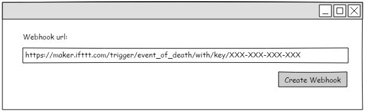
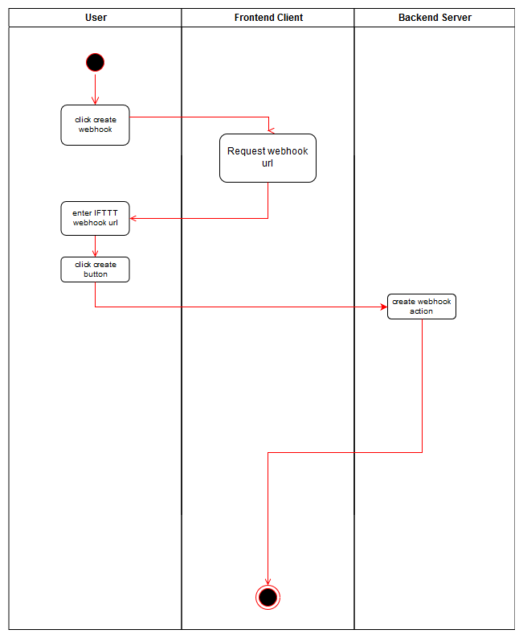

# Use-Case Specification: Connect to IFTTT

# 1. Connect to IFTTT

## 1.1 Brief Description
This use case allows a user to connect their own applets on IFTTT with DigiWill.

## 1.2 Mockups

## 1.3 Screenshots

N/A

# 2. Flow of Events

## 2.1 Basic Flow

### Activity Diagram

# 3. Special Requirements

N/A

# 4. Preconditions
The main precondition for this use case is:

 1. The user needs to be registered.

# 5. Postconditions

## 5.1 Refresh sign of life status
After connecting with IFTTT the user will be able to trigger his applets with the DigiWill event of death.

# 6. Function Points

N/A
