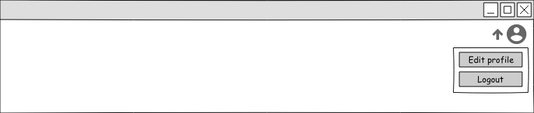
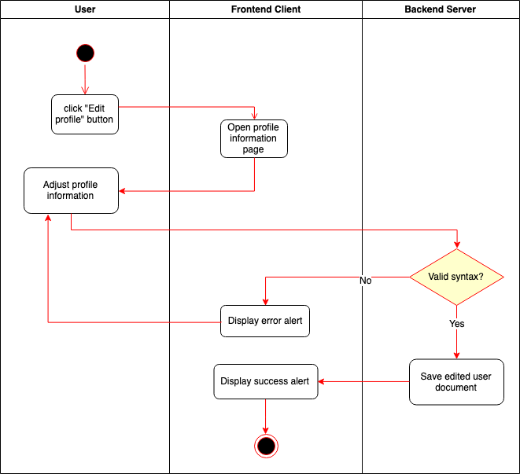

# Use-Case Specification: Edit profile information

# 1. Edit profile information

## 1.1 Brief Description
A registered user can adjust profile information like the amount of time when he should receive sign of life reminders or when activities get triggered.

## 1.2 Mockups

## 1.3 Screenshots

N/A

# 2. Flow of Events

## 2.1 Basic Flow

### Activity Diagram

# 3. Special Requirements

N/A

# 4. Preconditions

The user is registered and has logged in.

# 5. Postconditions

The adjusted profile fields are saved.

# 6. Function Points

N/A
