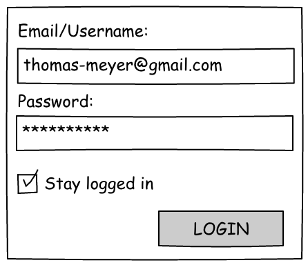
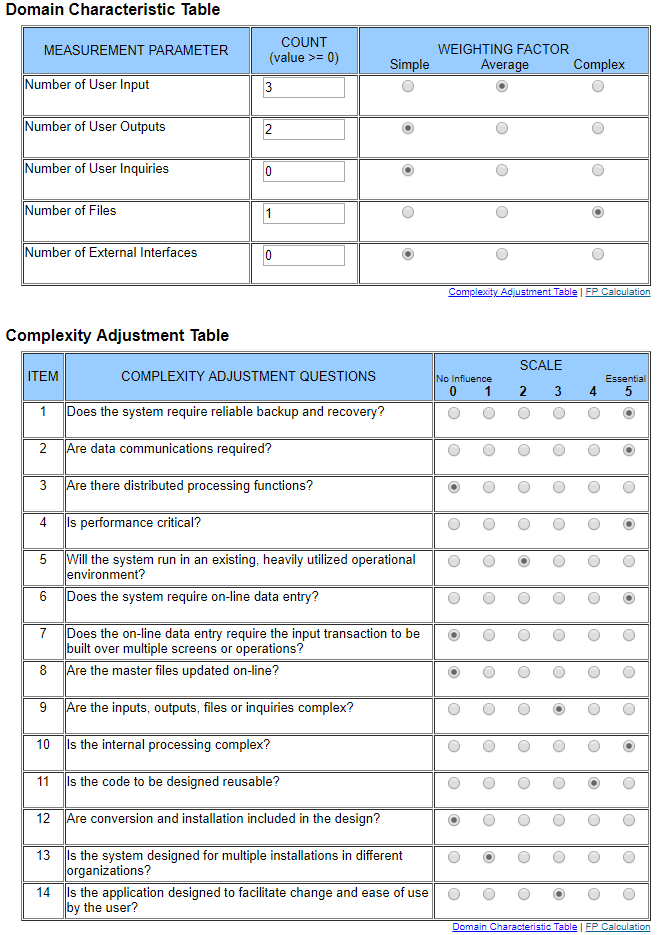

# Use-Case Specification: Login

# 1. Login

## 1.1 Brief Description
This use case allows a user to login with his registered account by entering his Email adress or username and password. He can do this by using the web or mobile application.

## 1.2 Mockups

## 1.3 Screenshots

N/A

# 2. Flow of Events

## 2.1 Basic Flow

### Activity Diagram

If you're interested in our [.feature file](https://raw.githubusercontent.com/DigiWill-dhbw/DigiWill/master/Backend/src/test/resources/cucumber/login.feature) you can view how tests will be conducted.

# 3. Special Requirements

N/A

# 4. Preconditions
The main precondition for this use case are:

 1. The user is registered.

# 5. Postconditions

## 5.1 Saved login sessions
While entering his login credentials the user can decide by clicking on a checkbox wether the login session should be saved or not. When he does he must not enter his credentials after restarting the application anymore. Between the last and next login five days can pass until the stored session gets deleted and the user must login again. Stored sessions do only exist in the web application and only three at the same time.

# 6. Function Points

To calulate the function points for a specific use case we used the [TINY TOOLS FP Calculator](http://groups.umd.umich.edu/cis/course.des/cis525/js/f00/harvey/FP_Calc.html)

> => 19.55 Function Points
