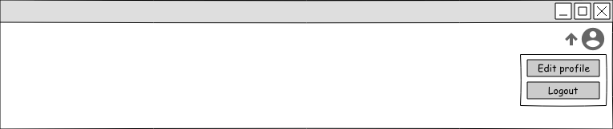

# Use-Case Specification: Logout

# 1. Logout

## 1.1 Brief Description
When a user is able to login he can also logout from his registered account. He can do this by using the web or mobile application.

## 1.2 Mockups

## 1.3 Screenshots

N/A

# 2. Flow of Events

## 2.1 Basic Flow

### Activity Diagram

If you're interested in our [.feature file](https://raw.githubusercontent.com/DigiWill-dhbw/DigiWill/master/Backend/src/test/resources/cucumber/logout.feature) you can view how tests will be conducted.

# 3. Special Requirements

N/A

# 4. Preconditions
The main precondition for this use case are:

 1. The user is registered.
 2. The user is logged in.

# 5. Postconditions

## 5.1 Delete stored login sessions
When the current session was stored in the previous login, the stored session will be deleted after he logged out manually.

# 6. Function Points

N/A
