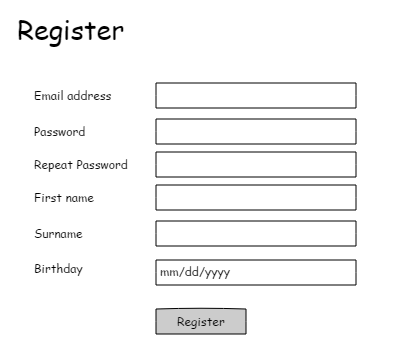
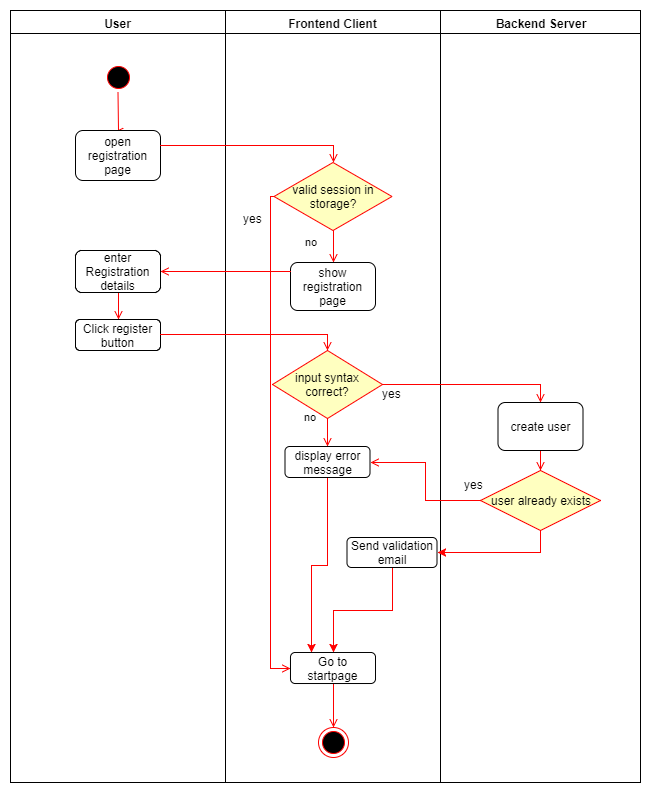

# Use-Case Specification: Register

# 1. Register

## 1.1 Brief Description
This use case allows a new user to create a new account to get access to the services of the application.

## 1.2 Mockups

## 1.3 Screenshots

N/A

# 2. Flow of Events

## 2.1 Basic Flow

### Activity Diagram

# 3. Special Requirements

N/A

# 4. Preconditions
The main precondition for this use case is:

 1. The user needs a valid email address to register.

# 5. Postconditions

## 5.1 Create new user credentials
After entering the required information the user will get an email with a link to validate his email address. Afterwards he is allowed to login with his credentials and he has to setup his profile.

# 6. Function Points

To calulate the function points for a specific use case we used the [TINY TOOLS FP Calculator](http://groups.umd.umich.edu/cis/course.des/cis525/js/f00/harvey/FP_Calc.html).

### Domain Characteristic Table

### Complexity Adjustment Table

> => 45.5
