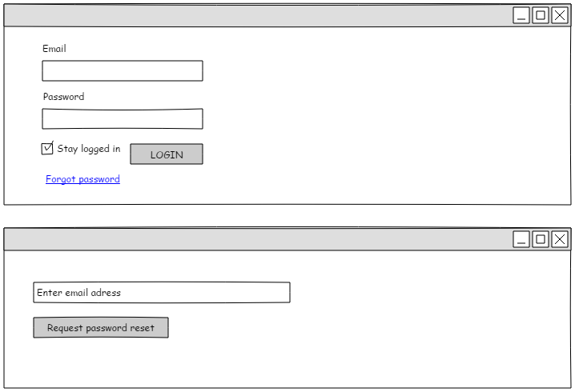
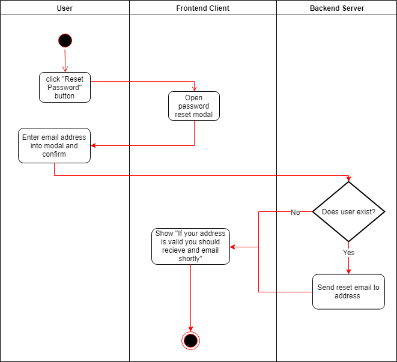
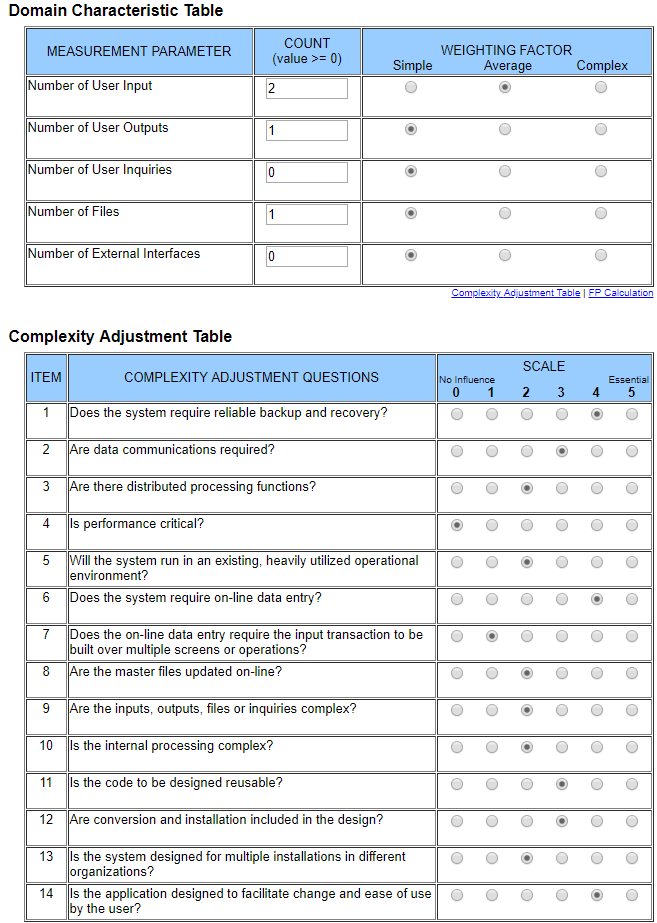

# Use-Case Specification: Request password reset

# 1. Logout

## 1.1 Brief Description
When a user forgot his password he can request to receive a reset email.

## 1.2 Mockups

## 1.3 Screenshots

N/A

# 2. Flow of Events

## 2.1 Basic Flow

### Activity Diagram

# 3. Special Requirements

N/A

# 4. Preconditions
The main precondition for this use case are:

 1. The user is not logged in
 2. The user remembers his email address

# 5. Postconditions
If the email address exists in out database it should receive a reset email with a link that leads them to a reset page.

# 6. Function Points

To calulate the function points for a specific use case we used the [TINY TOOLS FP Calculator](http://groups.umd.umich.edu/cis/course.des/cis525/js/f00/harvey/FP_Calc.html).

> => 18.81
