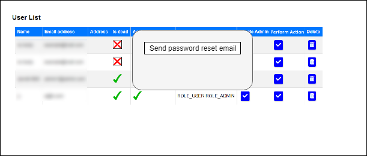
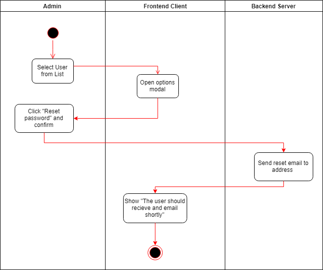

# Use-Case Specification: Request password reset for user

# 1. Logout

## 1.1 Brief Description
As an admin I can request a password reset for a user so they receive a reset email.

## 1.2 Mockups
N/A

## 1.3 Screenshots

# 2. Flow of Events

## 2.1 Basic Flow

### Activity Diagram

# 3. Special Requirements

N/A

# 4. Preconditions
The main precondition for this use case are:

 1. The admin is logged in
 2. The admin is on the user overview list

# 5. Postconditions
The selected user should receive a reset email with a link that leads them to a reset page.

# 6. Function Points

To calulate the function points for a specific use case we used the [TINY TOOLS FP Calculator](http://groups.umd.umich.edu/cis/course.des/cis525/js/f00/harvey/FP_Calc.html).

> => 18.81
