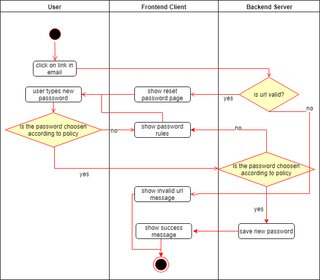

# Use-Case Specification: Reset Password

# 1. Reset Password

## 1.1 Brief Description
A user clicks on an password reset url. If it is valid it presents him an interface which allows him to change his password according to the password rules. 
If the url is invalid there should be an appropriate information message for the user.

## 1.2 Mockups

N/A

## 1.3 Screenshots

N/A

# 2. Flow of Events

## 2.1 Basic Flow

### Activity Diagram

# 3. Special Requirements

N/A

# 4. Preconditions

User has an email with a link

# 5. Postconditions

# 6. Function Points

N/A
