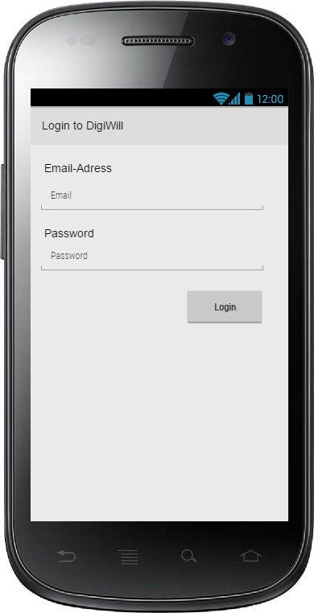
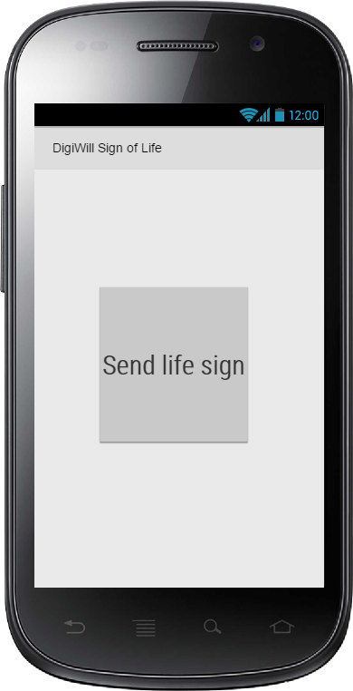
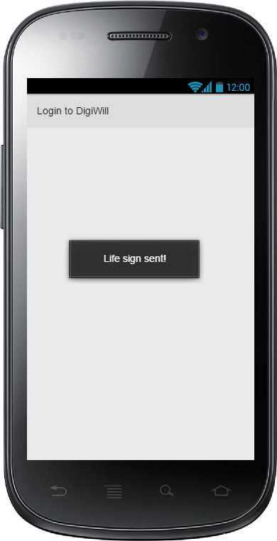
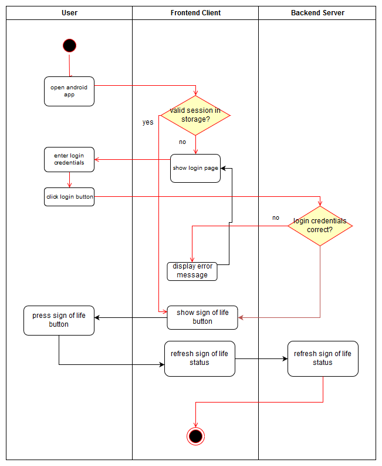

# Use-Case Specification: Send life sign through app

# 1. Send life sign through app

## 1.1 Brief Description
This use case allows a user to send a sign of life to keep the service informed that he didn't pass away.

## 1.2 Mockups

## 1.3 Screenshots

N/A

# 2. Flow of Events

## 2.1 Basic Flow

### Activity Diagram

# 3. Special Requirements

N/A

# 4. Preconditions
The main precondition for this use case is:

 1. The user needs to be registered.

# 5. Postconditions

## 5.1 Refresh sign of life status
After pressing the sign of life button, the state of the user will be refreshed to alive for the setted amount time until the next sign of life is required.

# 6. Function Points

N/A
