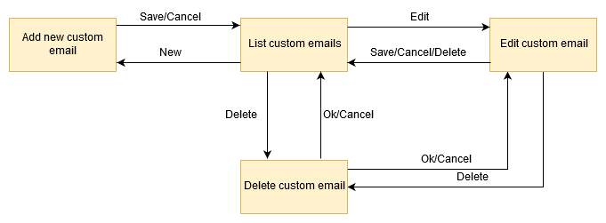
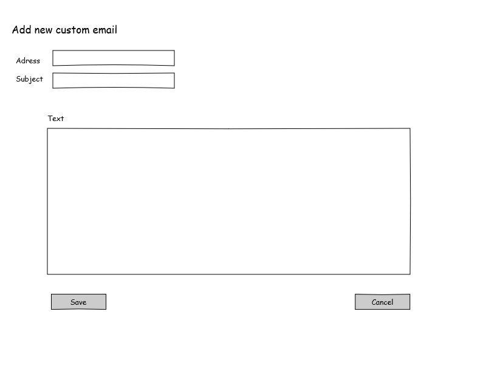
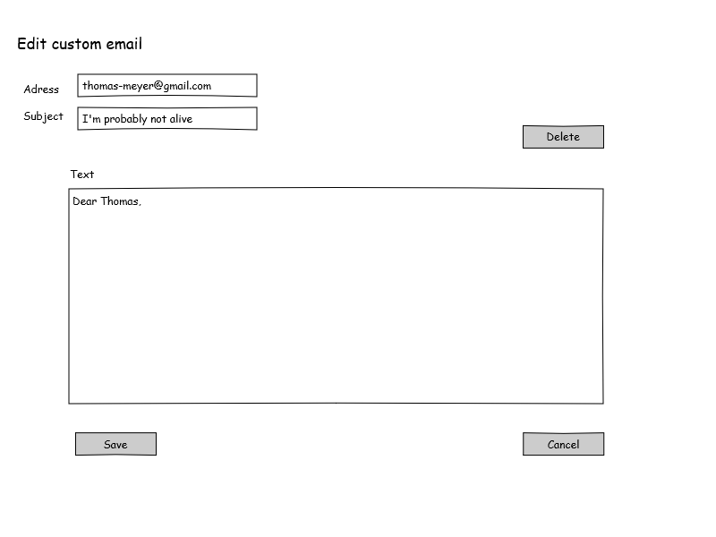
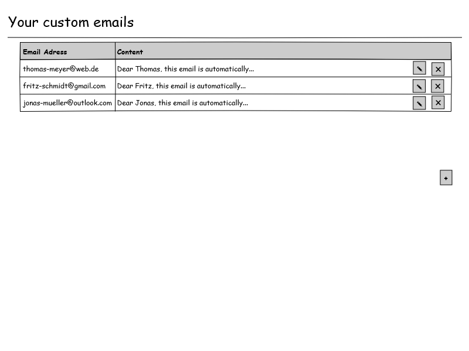
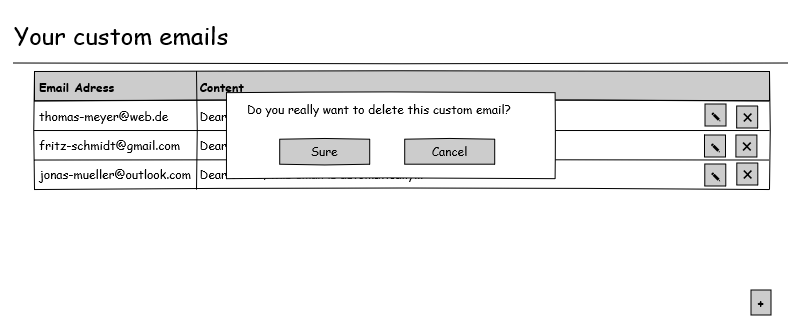
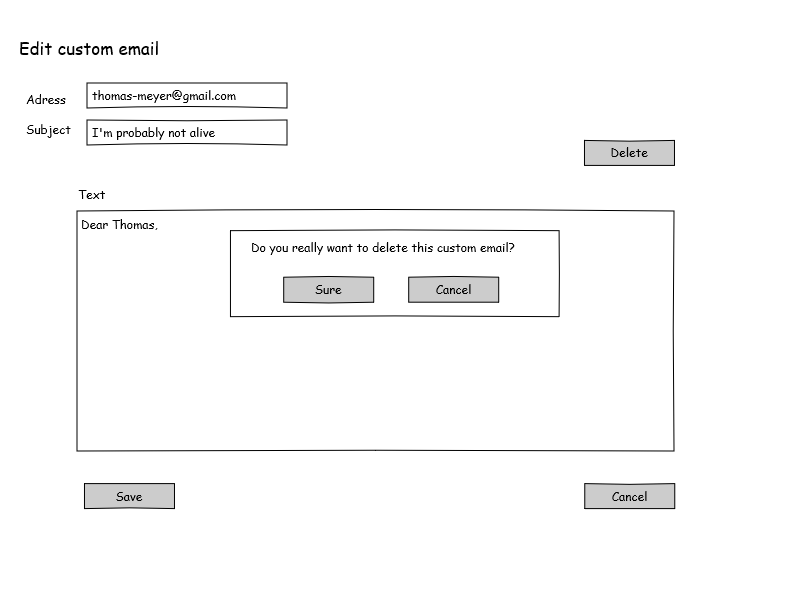
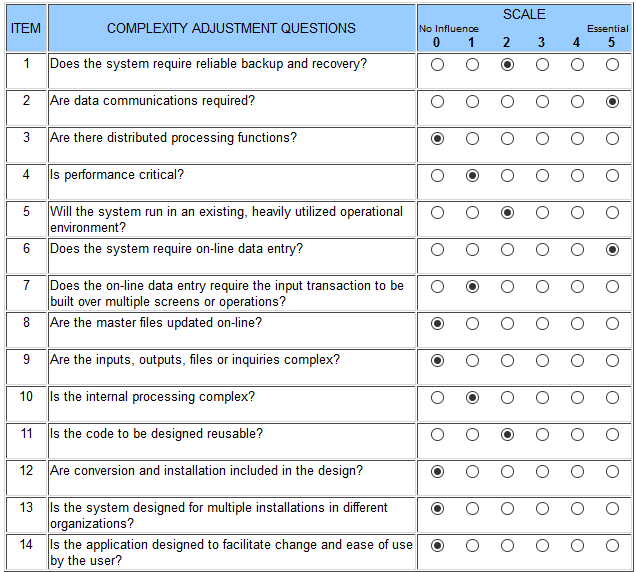

# DigitalWill
## Use-Case Specification: Setup custom emails | Version 1.1

## 1. Use-Case: Setup custom emails

### 1.1 Brief Description

This use case describes the creation, reading, updating and deleting of custom emails (CRUD).

## 2. Flow of Events

### 2.1 Basic flow

In general a user will create several custom emails send in the event of his death. He can list all of this custom emails, edit and sometimes also delete them.

### 2.2 Creation  

The creation of a new custom email. The user will be asked to enter an email adress, a subject and a text.

### 2.3 Edit

While editing the user can modify the email adress, the subject and the text.

### 2.3 List

The user can list all of his custom emails he already setup.

### 2.4 Delete

Of course the user needs to delete custom emails from time to time. Therefore there is a delete button while editing and for every entry in the in the listing. To ensure he doesn't delete a custom email by accident a modal asks him, if he really wants to delete this.

## 3. Special Requirements

### 3.1 Owning An Account

In order to create a new custom email the user has to have an account. Otherwise it will not be possible to create a custom email.

## 4. Preconditions

### 4.1 The user has to be logged in

To ensure security and privacy the user has to be logged in when working with his custom emails.

## 5. Postconditions

### 5.1 Create

After creating an option, the user will be redirected to the list overview, where he can see the new custom email already displayed.

### 5.2 Edit

After the user finished the editing of his custom email, the updated version will be displayed in the list overview.

### 5.3 Delete

After confirming the deletion modal, the user will be redirected to the list overview and the email will be permanently deleted and no longer display in the listing.

## 6. Function Points

To calulate the function points for a specific use case we used the [TINY TOOLS FP Calculator](http://groups.umd.umich.edu/cis/course.des/cis525/js/f00/harvey/FP_Calc.html).

    Score:      31.08 Function Points.
    Time spent: 150min.

####Domain Characteristic Table

####Complexity Adjustment Table

