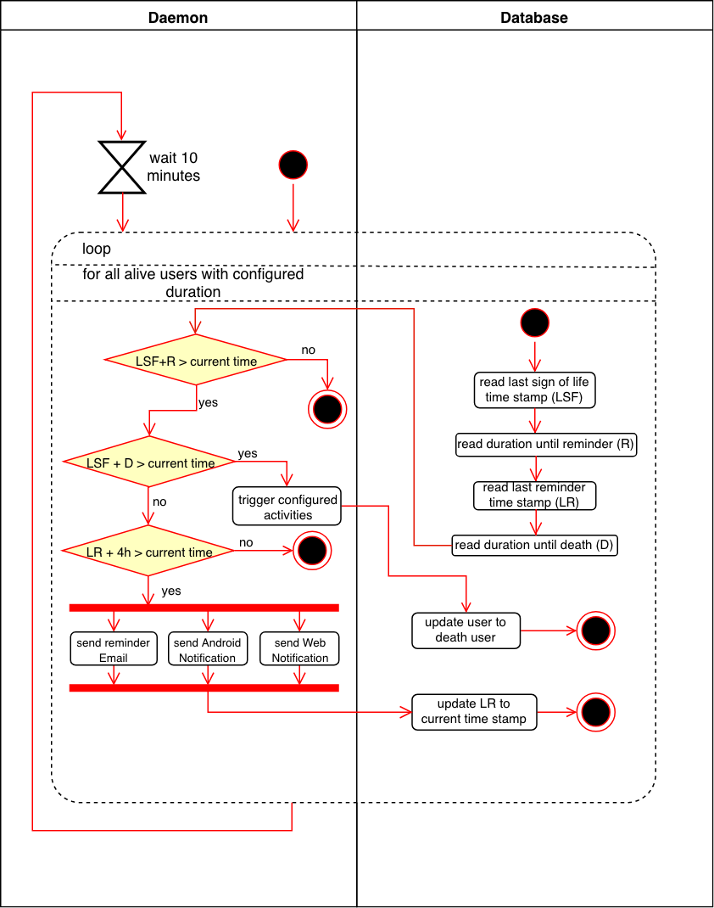

# Use-Case Specification: Sign of life daemon

# 1. Sign of life daemon

## 1.1 Brief Description
This use case describes a process where the system monitors wether a user is alive or dead. A user can send life signs, but if he does not he will get reminders after a certain amount of time. When reminders are ignored, the system assumes that the user died. After that, custom activities that were configured before (e.g. sending emails or contacting relatives) will be triggered. This process is running in background, therefore no mockups are provided.

## 1.2 Screenshots

N/A

# 2. Flow of Events

## 2.1 Basic Flow

### Activity Diagram

If you're interested in out [.feature file](https://raw.githubusercontent.com/DigiWill-dhbw/DigiWill/master/Backend/src/test/resources/cucumber/setupCustomEmails.feature) you can also view that to see how test will be conducted.

# 3. Special Requirements

N/A

# 4. Preconditions
The main precondition for this use case are:

 1. The user is registered.
 1. The user has set a duration in his profile settings until the system contacts him.

# 5. Postconditions

## 5.1 Trigger configured activities
After the system triggered configured activities the account is banned and must be reactivated by a system admin if the owner is still alive.

# 6. Function Points
To calulate the function points for a specific use case we used the [TINY TOOLS FP Calculator](http://groups.umd.umich.edu/cis/course.des/cis525/js/f00/harvey/FP_Calc.html).

    Score:      15.6 Function Points.
    Time spent: 120min.

