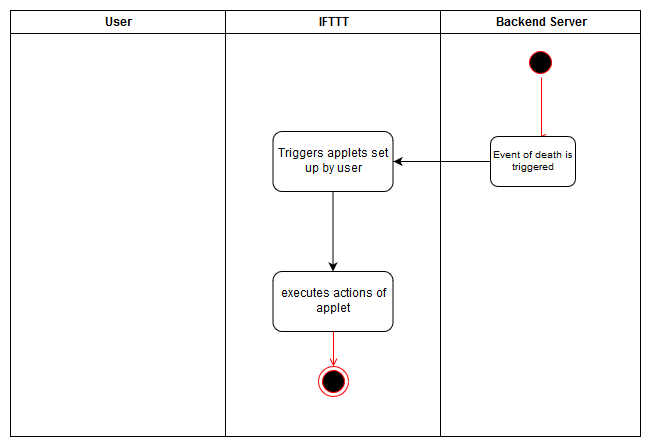

# Use-Case Specification: Trigger IFTTT applets

# 1. Trigger IFTTT applets

## 1.1 Brief Description
This use case describes the process when the event of death triggers an IFTTT trigger of an user.

## 1.2 Screenshots

N/A

# 2. Flow of Events

## 2.1 Basic Flow

### Activity Diagram

# 3. Special Requirements

N/A

# 4. Preconditions
The main precondition for this use case are:

 1. The user is registered.
 1. The user has set an applet on IFTTT which is triggered by DigiWill.

# 5. Postconditions

## 5.1 Trigger configured activities
After the system triggered an applet on IFTTT, IFTTT will execute the actions which were set up by the user.

# 6. Function Points

N/A