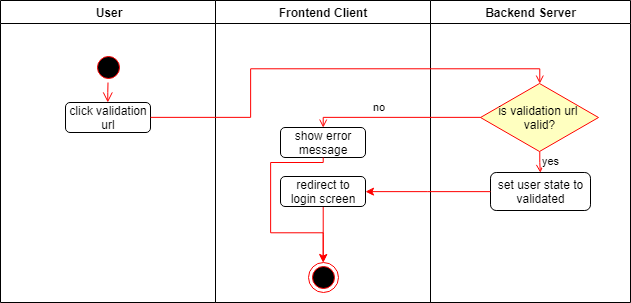

# Use-Case Specification: Validate User

# 1. Validate User

## 1.1 Brief Description
User gets an link per mail which allows him to validate his email adress.

## 1.2 Mockups

N/A

## 1.3 Screenshots

N/A

# 2. Flow of Events

## 2.1 Basic Flow

### Activity Diagram

# 3. Special Requirements

N/A

# 4. Preconditions
The main precondition for this use case are:

 1. The user is registered.
 2. The user has access to the email adress which he used to register.

# 5. Postconditions
User state is set to validated.
The user has to fill out his initial informations in a form

# 6. Function Points

N/A
